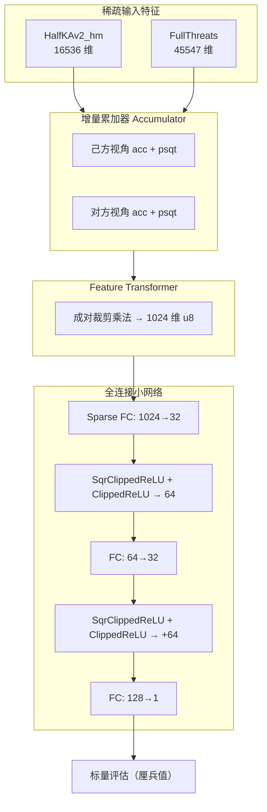
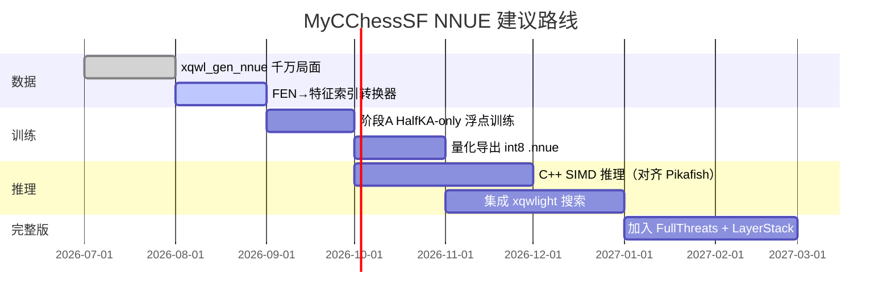

# Pikafish NNUE 架构调研与 MyCChessSF 训练建议

> 调研日期：2026-07-11  
> 主要参考：[official-pikafish/Pikafish](https://github.com/official-pikafish/Pikafish) `master` 分支源码、`nnue-pytorch` 文档、Pikafish Wiki。

## 1. 背景与目标

MyCChessSF 已通过 `xqwl_gen_nnue` 生成 **FEN + 搜索评分（vl）** 监督数据，下一步是训练 **NNUE（Efficiently Updatable Neural Network）** 评估函数。

NNUE 的核心约束：

1. **推理必须极快**：搜索中每个节点都要评估，不能像普通深度网络那样全量前向。
2. **必须支持增量更新**：走一步棋只更新少量特征，而非重算整张网。
3. **必须方便 SIMD**：权重 int8、层宽对齐向量寄存器，使用 `dpbusd` / VNNI 等指令。

Pikafish 是目前最强的开源中国象棋引擎之一，NNUE 实现成熟，**应作为模型结构与 SIMD 实现的首选参考**。

---

## 2. Pikafish NNUE 总体架构



数据流分三阶段（与 Stockfish NNUE 一脉相承）：

| 阶段 | 组件 | 作用 |
|------|------|------|
| 特征提取 | `HalfKAv2_hm` + `FullThreats` | 局面 → 稀疏特征索引 |
| 特征变换 | `FeatureTransformer` | 稀疏特征 → 1024 维稠密 u8 向量 |
| 网络推理 | `NetworkArchitecture` | 小 FC 网 → 1 个评估值 |

---

## 3. 特征集（Input Features）

### 3.1 HalfKAv2_hm（象棋版 HalfKA，棋子-王关系）

源码：`src/nnue/features/half_ka_v2_hm.h`

这是 Pikafish 从国际象棋 **HalfKAv2_hm** 移植并针对 **9×10 棋盘** 改造的特征，Wiki 中亦称其象棋等价物为 **HalfKAv2_xq** 思路。

**编码思想：**

- 以**己方帅/将位置**为锚点（含镜像、分桶）。
- 每个「己方王桶 × 攻击模式桶 × 棋子平面」对应一个特征维度。
- 局面中最多约 **32 个活跃特征**（双方各若干子力）。

**关键常量（Pikafish master）：**

| 常量 | 值 | 含义 |
|------|-----|------|
| `PS_NB` | 689 | 每个王桶下的棋子平面数 |
| `AttackBucketNB` | 4 | 攻击模式桶数 |
| 王位置桶 | 6 | `KingBuckets` 映射 |
| `Dimensions` | **16,536** | `6 × 4 × 689` |
| `MaxActiveDimensions` | 32 | 同时激活特征上限 |
| `HashValue` | `0x7f234cb8` | 网络文件嵌入哈希 |

**象棋特有设计：**

- 棋盘 90 格（`SQUARE_NB`），帅/将始终在九宫格。
- 按子力类型区分有效位（如兵、象的过河区域限制）。
- **Mid-mirror 编码**：处理 FILE_E 中线对称，减少特征冗余。

### 3.2 FullThreats（威胁特征）

源码：`src/nnue/features/full_threats.h`

| 常量 | 值 |
|------|-----|
| `Dimensions` | **45,547** |
| `MaxActiveDimensions` | 64 |
| `HashValue` | `0x8f234cb8` |

编码「攻击者-起点-终点-被攻击子」类的威胁关系，补充 HalfKA 未覆盖的战术信息。走子后通过 `DirtyThreats` 增量维护。

### 3.3 特征 → 累加器（Accumulator）

- 每个特征索引 `i` 对应权重列 `weights[i * L1 : (i+1) * L1]`（`L1=1024`）。
- 局面评估时维护 **int16 累加器**，而非每次做稀疏矩阵乘法。
- 走子：只对 **removed / added** 特征索引做加减（`append_changed_indices`）。
- 另维护 **PSQT 累加器**（`PSQTBuckets = 16`），按材料分层输出额外分数。

这是 NNUE 能在搜索中高速运行的根本原因。

---

## 4. 网络结构（NetworkArchitecture）

源码：`src/nnue/nnue_architecture.h`

### 4.1 层尺寸

```cpp
constexpr IndexType L1 = 1024;   // Feature Transformer 输出维
constexpr int L2 = 32;           // 第一隐藏层
constexpr int L3 = 32;           // 第二隐藏层
constexpr IndexType PSQTBuckets = 16;
constexpr IndexType LayerStacks = 16;
```

### 4.2 各层定义

| 层 | 类型 | 输入 → 输出 | 激活 |
|----|------|-------------|------|
| Feature Transformer | 稀疏线性 + 成对乘法 | acc(1024×2) → **1024 × u8** | clip + pairwise mul ÷512 |
| `fc_0` | `AffineTransformSparseInput` | 1024 → **32** | — |
| `ac_sqr_0` | `SqrClippedReLU` | 32 → 32 | x² 裁剪 |
| `ac_0` | `ClippedReLU` | 32 → 32 | max(0,x) 裁剪 |
| （拼接） | concat | — | **64** 维 |
| `fc_1` | `AffineTransform` | 64 → **32** | — |
| `ac_sqr_1` + `ac_1` | 同上 | 32 → 32+32 | 再拼 **64** 维 |
| `fc_2` | `AffineTransform` | **128** → **1** | 线性输出 |

`fc_2` 的 128 维输入 = `L2×2 + L3×2 = 32×2 + 32×2`。

此外 `fc_0` 最后两个输出构成 **skip connection**（`skip_0 = out[L2-2] - out[L2-1]`），加到最终输出。

### 4.3 前向传播伪代码

```
transformed[1024] = FeatureTransformer(accumulator)   // u8
h0[32]            = SparseFC_u8_i8(transformed)       // i32
sq0[32]           = SqrClippedReLU(h0)
r0[32]            = ClippedReLU(h0)
concat[0:64]      = [sq0 | r0]
h1[32]            = FC_i8(concat[0:64])
sq1[32]           = SqrClippedReLU(h1)
r1[32]            = ClippedReLU(h1)
concat[64:128]    = [sq1 | r1]
out               = FC_i8(concat[0:128]) + skip_0
return centipawn  = out * (600 * OutputScale) / (HiddenOneVal * 2^WeightScaleBits * 2)
```

---

## 5. 量化与数值标定

源码：`src/nnue/nnue_common.h`

| 常量 | 值 | 说明 |
|------|-----|------|
| `WeightType` | **int8** | 全连接权重 |
| `ThreatWeightType` | **int8** | 威胁特征权重 |
| `BiasType` | **int16** | 偏置 / 累加器 |
| `PSQTWeightType` | **int32** | PSQT 权重 |
| `TransformedFeatureType` | **uint8** | FT 输出 |
| `WeightScaleBits` | 6 | 权重定点小数位 |
| `OutputScale` | 16 | 输出额外缩放 |
| `FtMaxVal` | 255 | FT 裁剪上界 |
| `HiddenOneVal` | 128 | 隐藏层「1.0」的量化表示 |
| `Version` | `0x6A448AFA` | .nnue 文件版本 |

**权重加载时放大 2 倍**（`permute_weights` 相关逻辑），配合 `packus` / `mulhi` 实现裁剪与成对乘法，避免显式 min/max。

**输出标定：** 内部量化值映射到引擎厘兵值，使「1.0 优势 ≈ 600 cp」量级，与搜索兼容。

`.nnue` 文件使用 **LEB128 压缩** 存储偏置等大数组，加载时解压并做 **SIMD 权重置换（permute）**。

---

## 6. SIMD 优化要点（推理侧）

### 6.1 支持的指令集

| 平台 | 宏 | 向量宽度 | 关键指令 |
|------|-----|----------|----------|
| x86 AVX-512 | `USE_AVX512` | 64 B | `_mm512_add_epi32`, VNNI `dpbusd` |
| x86 AVX2 | `USE_AVX2` | 32 B | `_mm256_maddubs_epi16`, `dpbusd` |
| x86 SSSE3 | `USE_SSSE3` | 16 B | `_mm_maddubs_epi16` |
| ARM NEON | `USE_NEON` | 16 B | `vmull_u8`, dotprod |
| LoongArch | `USE_LSX/LASX` | 16/32 B | 类似 SSE/AVX 路径 |
| RISC-V | `USE_RVV` | 可变 | 向量扩展 |

编译时通过 Makefile 选择 `-DUSE_AVX2` 等，**二进制与 .nnue 网络文件版本绑定**。

### 6.2 必须遵守的对齐与尺寸约束

1. **输出维度 `% 16 == 0`**：`AffineTransformSparseInput` 静态断言（`L2=32` 满足）。
2. **输入维度 `% 256 == 0`**：稀疏 FC 的 bitset 分块（`1024 % 256 == 0` 满足）。
3. **权重按 ChunkSize=4 打乱存储**：匹配 `dpbusd` 加载模式（`get_weight_index_scrambled`）。
4. **Feature Transformer 权重置换**：`PackusEpi16Order` 针对 AVX2/AVX512 优化 pack 顺序。
5. **CacheLineSize = 64**：累加器、权重数组 `alignas(64)`。

### 6.3 稀疏第一层加速

- FT 输出极稀疏（1024 维中仅少数非零）。
- 维护 `NNZInfo`：非零索引列表或 **bitset**（每 256 维一块）。
- 仅对非零输入维度累加权重列：`input[i] * W[:, i]`，用 `dpbusd` 一次处理 4 列。

### 6.4 增量更新

搜索树中：

```
acc_new = acc_old
for i in removed_features: acc_new -= W[i]
for i in added_features:   acc_new += W[i]
```

仅 Feature Transformer 与后续 FC 在需要时重算。这比 MyCChessSF 当前「每局面完整搜索」快几个数量级，也是 NNUE 能替代手工评估的关键。

---

## 7. 训练工具链

| 工具 | 用途 |
|------|------|
| [nnue-pytorch](https://github.com/official-stockfish/nnue-pytorch) | Stockfish 官方训练框架 |
| [variant-nnue-pytorch](https://github.com/fairy-stockfish/variant-nnue-pytorch) | 象棋变体扩展（Fairy-Stockfish 系） |
| Pikafish `tools` 分支 / 数据管线 | 生成与 Pikafish 特征兼容的训练数据 |

**训练要点（nnue-pytorch 文档）：**

- 输入极度稀疏（激活率约 **0.1%**），必须用 **批量 COO 稀疏张量**，不要用稠密展开。
- 使用 `torch._sparse_coo_tensor_unsafe` + `._coalesced_(True)` 避免 O(n) 校验。
- 特征因子化（`HalfKAv2^`）训练时需 **C++ 数据加载器**，Python 侧不支持 factorizer。
- 默认流程：大数据集 → `train.py` → 导出 `.nnue` → 引擎加载验证。

Pikafish 训练数据来自 [Pika Xiangqi Zero](https://github.com/official-pikafish) 项目（ODbL），与我们的 XQWL 搜索标签来源不同，但**监督形式一致**（局面 → 强搜索分）。

---

## 8. 与 MyCChessSF 数据管线的对接

### 8.1 当前数据格式

`xqwl_gen_nnue` 输出：

```text
<fen>\t<vl>\n
```

- `vl`：XQWL Alpha-Beta 根搜索分，**行棋方视角**。
- 量级：一般 ±200 以内，优势局面 ±100+，将杀级近 ±9800。

### 8.2 标签对齐

| Pikafish 输出 | MyCChessSF 标签 | 对齐方式 |
|---------------|-----------------|----------|
| 内部量化 → cp | `vl`（厘兵值） | 训练时线性缩放至 `[-1,1]` 或定点整数 |
| 行棋方视角 | 行棋方视角 | **已一致**，可直接作回归目标 |
| LayerStack 分桶 | 无 | 可按子力简化分桶，或先固定单栈 |

建议训练目标：

```
target_cp = vl   // 行棋方视角
// 或压缩极端值：
target_cp = clamp(vl, -2000, 2000)
```

### 8.3 特征提取差距

我们的 `.txt` 只有 FEN，**不含** Pikafish 特征索引。训练前需增加：

```
FEN → Position 对象 → HalfKAv2_hm / FullThreats 特征索引
```

可选路径：

1. **复用 Pikafish 源码** 中的特征提取（推荐，保证与推理一致）。
2. **移植到 MyCChessSF C++**（长期，便于与 `xqwlight_core` 集成）。
3. **Python 复现特征**（仅适合原型，难保证 SIMD 路径一致）。

---

## 9. 推荐的 MyCChessSF NNUE 模型结构

为兼顾 **训练可行性**、**SIMD 推理** 与 **后续引擎集成**，建议分阶段：

### 9.1 阶段 A：最小可用 NNUE（建议先实现）

与 Pikafish **隐藏层结构一致**，特征先简化：

| 组件 | 建议 |
|------|------|
| 特征 | **仅 HalfKAv2 象棋版**（先不做 FullThreats） |
| `L1` | **1024**（与 Pikafish 相同，SIMD 路径现成） |
| `L2`, `L3` | **32, 32**（与 Pikafish 相同） |
| 量化 | int8 权重 / int16 累加器 / u8 FT 输出 |
| PSQT | 16 桶（可先简化为 8 或单桶验证） |
| LayerStack | 先固定 1 栈，后续再加 16 栈 |

**理由：** `L1=1024, L2=L3=32` 是 Pikafish 已验证的 SIMD 友好尺寸；去掉 FullThreats 可将特征工程复杂度减半，仍保留增量更新核心。

### 9.2 阶段 B：Pikafish 完全兼容

在阶段 A 收敛后：

- 加入 **FullThreats（45547 维）**。
- 实现完整 **16 层 LayerStack** 与 **PSQT 16 桶**。
- 导出与 Pikafish `NetworkArchitecture` 哈希一致的 `.nnue` 文件。
- 可直接在 Pikafish 或自研引擎中加载对比 Elo。

### 9.3 训练用浮点模型（nnue-pytorch 侧）

训练时使用 **浮点权重**，导出时再量化为 int8：

```
FeatureTransformer (float)
  → FC0 (1024 → 32, float)
  → [SqrClippedReLU, ClippedReLU]
  → FC1 (64 → 32)
  → [SqrClippedReLU, ClippedReLU]
  → FC2 (128 → 1)
Loss: MSE(pred_cp, target_cp)  或 Huber
```

稀疏输入层用 COO batch；推理用量化 int8 版本。

### 9.4 不建议的做法

| 做法 | 原因 |
|------|------|
| 直接用 14 平面稠密 CNN（MyCChessRL 风格） | 无法增量更新，搜索中太慢 |
| 任意尺寸（如 L1=1000） | 破坏 `% 256`、`% 16` 对齐，SIMD 退化 |
| 训练用 float、推理用另一套结构 | 量化误差大，需 QAT 或同结构导出 |
| 跳过特征累加器 | 丧失 NNUE 核心优势 |

---

## 10. 参数量与磁盘估算

### 10.1 Pikafish 级网络（含 FullThreats）

粗略估算（仅数量级）：

| 组件 | 参数量 |
|------|--------|
| FT weights (HalfKA) | 16536 × 1024 ≈ 16.9M |
| FT weights (Threats) | 45547 × 1024 ≈ 46.6M |
| FT biases | 1024 |
| PSQT | ≈ (16536+45547) × 16 ≈ 1M |
| FC 层 | < 200K |
| **合计** | **约 65M 权重（int8）≈ 65 MB** |

实际 `.nnue` 文件经 LEB128 压缩后更小（典型数 MB～十余 MB）。

### 10.2 阶段 A（仅 HalfKA）

约 **17M int8 权重 ≈ 17 MB**，更适合首轮实验。

---

## 11. 实施路线图（建议）



1. **数据**：继续用 `xqwl_gen_nnue` 扩充分数覆盖；必要时多种 `think-ms` 混合。
2. **特征**：从 Pikafish 移植 `HalfKAv2_hm` 特征提取，写 `fen → features` 转换工具。
3. **训练**：fork `nnue-pytorch` 或 `variant-nnue-pytorch`，注册象棋特征，读取我们的数据格式。
4. **推理**：复用 Pikafish `src/nnue/` 下 `simd.h`、层实现，替换局面核为 `xqwlight_core`。
5. **验证**：固定局面集对比 NNUE 输出 vs XQWL 搜索分（MSE / 相关系数）。

---

## 12. 关键源码索引（Pikafish master）

| 文件 | 内容 |
|------|------|
| `src/nnue/nnue_architecture.h` | 网络层定义、L1/L2/L3 |
| `src/nnue/nnue_feature_transformer.h` | FT、累加器、SIMD 成对乘法 |
| `src/nnue/nnue_common.h` | 量化常量、LEB128 |
| `src/nnue/features/half_ka_v2_hm.h` | 象棋 HalfKA 特征 |
| `src/nnue/features/full_threats.h` | 威胁特征 |
| `src/nnue/layers/affine_transform_sparse_input.h` | 稀疏 FC + dpbusd |
| `src/nnue/simd.h` | 向量指令封装 |
| `src/nnue/nnue_accumulator.h` | 增量累加器 |

---

## 13. 结论

**若目标是「可 SIMD 加速、可嵌入搜索」的 NNUE，模型结构应尽可能贴近 Pikafish：**

```
[HalfKAv2_hm (+ FullThreats)] → Accumulator → FT(1024 u8)
  → SparseFC(1024→32) → [SqrClippedReLU|ClippedReLU]
  → FC(64→32) → [SqrClippedReLU|ClippedReLU]
  → FC(128→1) → cp
```

**MyCChessSF 已有数据（FEN + XQWL 搜索分）可充当 NNUE 训练标签**；缺口主要在 **FEN → Pikafish 特征索引** 的提取链路与 **量化导出 / SIMD 推理** 代码。

建议 **先实现阶段 A（HalfKA-only，L1=1024，L2=L3=32）** 验证整条管线，再补齐 FullThreats 以达到 Pikafish 同级网络容量。

---

## 14. 外部链接

- Pikafish 仓库：https://github.com/official-pikafish/Pikafish
- Pikafish Wiki（NNUE 说明）：https://github.com/official-pikafish/Pikafish/wiki/Advanced-topics
- nnue-pytorch 文档：https://github.com/official-stockfish/nnue-pytorch/blob/master/docs/nnue.md
- variant-nnue-pytorch（象棋变体）：https://github.com/fairy-stockfish/variant-nnue-pytorch
- 默认网络下载：http://test.pikafish.org（`pikafish.nnue`）
